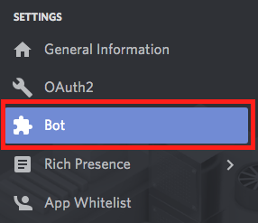
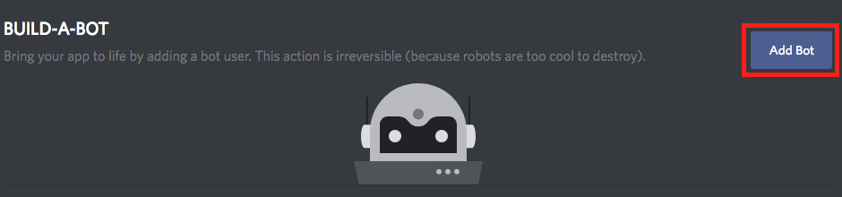

# CSSS Discord Bot (Wall-E)  

 

Wall-E, named after the lovable character [Wall-E](https://en.wikipedia.org/wiki/WALL-E), will hold all the scripts for the upcoming bot that will operate on the CSSS discord, located [here](https://discord.gg/Pf5Ncq3). This bot is owned by the CSSS and will be maintained by the current CSSS appointed Discord representative and the current bot development team. 

## Table of Contents
- [Current Commands](#current-commands)  
- [Local Setup](#local-setup)  
- [Current-Setup Info](#current-setup-info)  
- [Part 1: Authentication](#part-1-authentication)  
- [Part 2: Running the bot](#part-2-running-the-bot)  

## Current Commands

* `.ping` - returns `pong!`
* `.echo <arg>` - returns `<arg>`
* `.newrole <arg>` - creates role `<arg>`
* `.deleterole <arg>` - deletes role `<arg>`
* `.iam <arg>` - adds you to role `<arg>`
* `.iamn <arg>` - removes you from role `<arg>`
* `.whois <arg>` - returns everyone who has role `<arg>`
* `.poll <arg>` - starts a yes/no poll where `<arg>` is the question
* `.poll <arg0> <arg1> <arg2>` (up to 12 arguments) - starts a poll where `<arg0>` is the question and the remaining arguments are the options
* `.urban <arg>` - returns defintion of `<arg>` along with a link to the definition on urban dictionary

## Local Setup

#### Current-Setup Info  
Server IP: 178.128.184.141    
For access to the jenkins, notify someone on the following list:  
* Winfield Chen (CSSS VP) - csss-vp@sfu.ca  

Follow steps outlined in the [README for machine setup](files_for_machine_setup) steps to prepare the host machine to support CI/CD.

Follow the steps below [Part 1] to run the bot and do development on your local machine.  

### Part 1: Creating Bot and Attaching it to Development Server

1. Create your own Discord server for testing by
   1. Going to `https://discordapp.com/channels/@me`
   2. Clicking the + on the left side 

    

2. Navigate to `https://discordapp.com/developers/applications/me` and login
3. Click `Create New Application` 

 

4. Change the name of the Application to whatever you want and then click `Save Changes`
5. Take note of the `Client ID` for step 8
6. Click on `Bot` 

 

7. Click on `Add Bot` 

 

8. Navigate to `https://discordapp.com/oauth2/authorize?&client_id=YOUR_CLIENT_ID_HERE&scope=bot&permissions=2119564375`
   * `YOUR_CLIENT_ID` is the `CLIENT ID` you recorded in Step 5
9. Select the server you created and click `Authorize`

### Part 2: Running the Bot

Pre-requisites: `git`, `python3`, `python3-venv`, and `pip3`.

From a command line
1. Run `git clone https://github.com/CSSS/wall_e.git`
2. cd into `wall_e` directory
3. Run `python3.5 -m venv ENV`
4. Run `. ENV/bin/activate`
5. Run `python3.5 -m pip install -r requirements.txt`
6. Run `sudo apt-get install -y redis-server`
7. Edit `/etc/redis/redis.conf` to add line `notify-keyspace-events "Ex"`
8. Run `sudo service redis-server start`
9. Run `export TOKEN=token` with the `token` you obtained during the authentication step
10. Run `python3.5 main.py`
