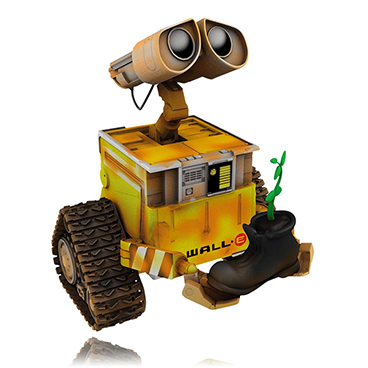

# CSSS Discord Bot (Wall-E)  

 

Wall-E, named after the lovable character [Wall-E](https://en.wikipedia.org/wiki/WALL-E), is the CSSS Discord Bot. This bot is owned by the CSSS and will be maintained by the current CSSS appointed Discord Manager and Bot_manager team. 

## Table of Contents
- [Current Commands](#current-commands)  
- [How to work on the bot](#local-setup)  
- [How to become a Bot_manager](Working_on_the_Bot.md)

## Current Commands

* `.ping` - returns `pong!`
* `.echo <arg>` - returns `<arg>`
* `.newrole <arg>` - creates role `<arg>`
* `.deleterole <arg>` - deletes role `<arg>`
* `.iam <arg>` - adds you to role `<arg>`
* `.iamn <arg>` - removes you from role `<arg>`
* `.whois <arg>` - returns everyone who has role `<arg>`
* `.poll <arg>` - starts a yes/no poll where `<arg>` is the question
* `.poll <arg0> <arg1> <arg2>` (up to 12 arguments) - starts a poll where `<arg0>` is the question and the remaining arguments are the options
* `.urban <arg>` - returns defintion of `<arg>` along with a link to the definition on urban dictionary