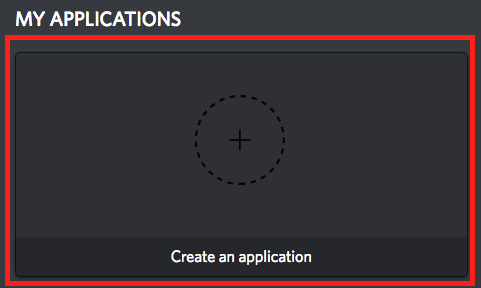
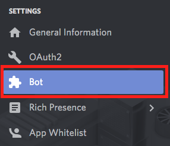

# Working on the Bot

## Local Setup

Follow the steps below [Part 1] to run the bot and do development on your local machine.  

### Part 1: Creating Bot and Attaching it to Development Server

1. Create your own Discord server for testing by
   1. Going to `https://discordapp.com/channels/@me`
   2. Clicking the + on the left side 

    

2. Navigate to `https://discordapp.com/developers/applications/me` and login
3. Click `Create New Application` 

 

4. Change the name of the Application to whatever you want and then click `Save Changes`
5. Take note of the `Client ID` for step 8
6. Click on `Bot` 

 

7. Click on `Add Bot` 

 

8. Navigate to `https://discordapp.com/oauth2/authorize?&client_id=YOUR_CLIENT_ID_HERE&scope=bot&permissions=2119564375`
   * `YOUR_CLIENT_ID` is the `CLIENT ID` you recorded in Step 5
9. Select the server you created and click `Authorize`

### Part 2: Running the Bot

Pre-requisites: `git`, `python3`, `python3-venv`, and `python3-pip`.

1. Fork the repo
1. From a command line
1. Run `git clone https://github.com/CSSS/wall_e.git`
2. cd into `wall_e` directory
3. Run `python3.5 -m venv ENV`
4. Run `. ENV/bin/activate`
5. Run `python3.5 -m pip install -r requirements.txt`
1. Redis Instructions
   1. Mac
      1. Run `brew install redis`
      1. Add `notify-keyspace-events "Ex"` to the end of `/usr/local/etc/redis.conf`
      1. Run `brew services start|stop|restart redis` to start, stop and restart redis
   1. Ubuntu
      1. Run `sudo apt-get install -y redis-server`
      1. Add `notify-keyspace-events "Ex"` to the end of `/etc/redis/redis.conf`
      1. Run `sudo service redis-server start`
1. Using Your Own Discord Test Server
   1. Run `export ENVIRONMENT='localhost'`
   1. Run `export TOKEN=token` with the `token` you obtained during the authentication step
   1. Run `export BOT_LOG_CHANNEL_ID=channel_id` with the channel id of the channel that will hold the logs on the discord server
   1. Run `export WOLFRAMAPI=apikey` with an API key obtained from [here](https://products.wolframalpha.com/api/)
   1. Run `python3.5 main.py`
1. Testing on [CSSS Bot Test Server](https://discord.gg/c3MPjY5)
   1. After you have tested on your own Discord Test Server, push your changes to [Wall-E](https://github.com/CSSS/wall_e). Pushing it will automatically load it into the CSSS Bot Test Server
9. Run `export TOKEN=token` with the `token` you obtained during the authentication step
10. Run `python3.5 main.py`