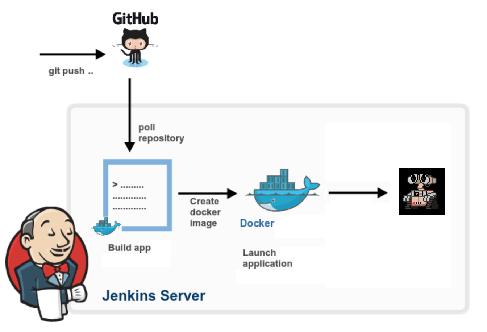
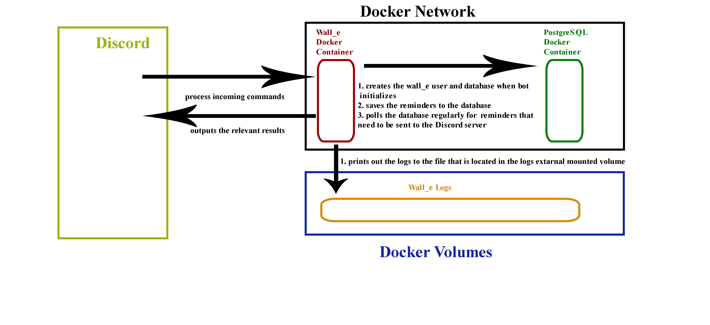

# Software Engineering and Process Document

Created by [Winfield Chen](https://github.com/wnfldchen) - wca988@sfu.ca

August 2018 Revision 1
March 2019 Revision 2

## Table of Contents
 - [Architecture](#architecture)
   - [Overview](#overview)
   - [Docker](#docker)
     - [Containers: A VM-Like Clean Running Environment For Wall-E](#containers-a-vm-like-clean-running-environment-for-wall-e)
   - [Jenkins](#jenkins)
     - [Pipelines: An Automated Way to Run The Latest Version of Wall-E](#pipelines-an-automated-way-to-run-the-latest-version-of-wall-e)
 - [Process](#process)
   - [Making Changes to Wall-E](#making-changes-to-wall-e)
     - [Local Testing: Pitfalls and Necessity](#local-testing-pitfalls-and-necessity)
   - [Proposing New Changes](#proposing-new-changes)
 - [Procedure](#procedure)
   - [Jenkins Login](#jenkins-login)
   - [Changing Jenkins Password](#changing-jenkins-password)
   - [Changing Bot Tokens](#changing-bot-token)
   - [Restarting Bot Using Jenkins](#restarting-bot-using-jenkins)
   - [Viewing Jenkins Output](#viewing-jenkins-output)
 - [Appendix](#appendix)
   - [Required Environment Variables](#required-environment-variables)
   - [Local Testing Recommended Procedures](#local-testing-recommended-procedures)
     - [Local Testing Outside of a Container](#local-testing-outside-of-a-container)
     - [Local Testing Inside of a Container](#local-testing-inside-of-a-container)
   - [The Role of Postgres in the RemindMe Command](#the-role-of-postgres-in-the-remindme-command)
 - [Changelog](#changelog)

## Architecture

### Overview

 
 

The Wall-E repository is synchronized with the Wall-E bot associated with the provided bot token. This is done using a continuous integration system known as Jenkins. The output of this automated process is the Wall-E bot inside of an isolated environment known as a Docker container, with some containers deployed with a testing token and containers from the repository master branch deployed with a production token.

### Docker

Docker is a computer program that performs operating-system-level virtualization, also known as containerization. Docker runs software packages called containers which are isolated bundles consisting only of a program and its dependencies such as tools, libraries, and configuration files. Containers are much like virtual machines except they are much more lightweight. Containers are created from images which specify the container’s filesystem and program run commands in a Dockerfile.

#### Containers: A VM-Like Clean Running Environment For Wall-E

Running Wall-E in a container brings with it several advantages. These advantages eliminate several categories of bugs stemming from poor package management and inconsistent developer environments. It is highly recommended that Wall-E be run in a Docker container at all times, including during local testing following the procedures as outlined in the appendix.

| Advantages of Running Wall-E in a Container | Disadvantages of Running Wall-E in a Container |
|---|---|
| <ul><li> Repeatable builds: no matter which computer is building the image, the same image is built.</li><li>Known starting state: the container is always built from the base image, meaning packages are installed from scratch, avoiding versioning issues and package conflicts.</li><li>Isolation: Wall-E is isolated from the rest of the system as well as from other instances of itself.</li></ul> | <ul><li>Harder to debug outside of an IDE: while IntelliJ IDEA can attach its debugger to programs inside of a running container it is much harder without an IDE.</li><li>Harder to access program output: output must be accessed using Docker’s log command or by an IDE.</li></ul> |

### Jenkins

Jenkins is a software-development automation server which connects version control systems like Git to ready-to-run programs. Jenkins is the process component which commands the building of the Docker container and launches it with the correct production or test environment variables.

#### Pipelines: An Automated Way To Run The Latest Version Of Wall-E

Jenkins automates deployments of each push using a pipeline, a procedure of one or more steps known as stages which are found in a Jenkinsfile.

-----
**Commonly-used stages in a Jenkins pipeline**

|Checkout|Build|Test|Deploy|
|---|---|---|---|
|the latest code is retrieved from version control|the code is built into an application|the application is tested (goes to testing)|the application goes to production|

-----
**Jenkins pipeline for Wall-E**

This process is triggered every push to the Wall-E repository

|Checkout|Build|Test|Deploy|
|---|---|---|---|
|the new code in the push is retrieved from Git|the Docker image is built according to the Dockerfile|a container of the image is run with the testing token and test variables|if push is to master a container with the production token is run|

This pipeline is defined in the repository’s Jenkinsfile and is read in by Jenkins on each push. Github notifies Jenkins of new pushes using webhooks to the server.

## Process

### Making changes to Wall-E

|Stage 1|Stage 2|Stage 3|Stage 4|
| --- | --- | --- | --- |
| <ol><li>Pick an issue from the repository.</li><li>**Make a branch** for that issue.</li></ol>| <ol><li>Start working on the issue **in the branch.**</li><li>**Push frequently** so Jenkins can deploy your code to the test server so **bugs can be caught early on.**</li><li>**Test on the test server and locally** frequently for bugs.</li></ol> | <ol><li>**Merge master** into your branch so you have others’ changes.</li><li>**After testing on the test server and locally** make a **pull request.**</li><li>Request a **review** from a reviewer.</li><li>**Continue Testing**</li></ol> | <ol><li>**Reviewer: test the changes on the test server** in addition to inspecting code before **approving.**</li><li>**Developer: merge and delete** the branch.</li></ol> |

#### Local Testing: Pitfalls and Necessity

Developers unfamiliar with continuous integration techniques may have a reliance on local testing which has the following disadvantages not present on the test server.
 * Package management and language versioning issues if not locally testing in a container
 * The need for a separate local test server         

However, local testing does make it possible to read application output in case of errors which makes it a necessity. The environment variables for this are in the appendix.

### Proposing New Changes

To propose a new change please make an issue on the repository.

## Procedure

### Jenkins Login

1. Go to [https://178.128.184.141/](https://178.128.184.141/)
1. Proceed through any browser security warnings.
   1. Advanced users may choose to install the **Computing Science Student Society Root CA** certificate authority into the browser.
1. Click **log in** at the top-right corner of the page.
1. Login with your provided credentials.

### Changing Jenkins Password

1. Click your name at the top-right corner of the page.
1. Click **Configure.**
1. Change your password and click **Save.**

### Changing Bot Token

1. From the Jenkins homepage (click the top-left logo) click on **Credentials**.
1. Click on **Wall-E Bot User Token**. If you would like to change the testing token, click on **Wall-E Bot User Token (Test)**.
1. Click on **Update**. Replace the contents of the Secret field with the new token. Click **Save**.

### Restarting Bot using Jenkins

1. From the Jenkins homepage (click the top-left logo) click on **wall-e**.
1. Click on **master**.
1. Click on **Build Now**.

### Viewing Jenkins Output

1. From the Jenkins homepage (click the top-left logo) click on **wall-e**.
1. Click on the desired branch.
1. Click on **Logs** of any stage in Stage View.
   1. Alternatively, click on a build number in the Build History.
   1. Or, click on a checkmark or X-mark from the repository.
   1. Or, click on a repository check’s **Details**.
1. Click on **Console Output**.

## Appendix

### Local Testing Recommended Procedures

#### Local Testing Outside Of A Container

 * Use of IntelliJ IDEA Ultimate Edition with Python plugin is recommended. A student license for the Ultimate Edition is available from Jetbrains with an email address from an educational institution.
 * Use the environment variable values for local testing specified in `[Working_on_the_Bot.md](Working_on_the_Bot.md)`. They can be entered into the Edit Configurations page under the Run menu in the Python section’s Configuration tab.
 * Make sure the following items are installed.
   * Python 3.5.5
   * All packages in requirements.txt (IntelliJ will prompt to install these)
   * PostgreSQL
 * Run the bot from IntelliJ IDEA which will attach the Python debugger and display the output for you if you select the Debug option.

#### Local Testing Inside Of A Container

 * Use of IntelliJ IDEA Ultimate Edition with Python and Docker plugins is recommended.
 * Use the environment variable values for local testing specified in `[Working_on_the_Bot.md](Working_on_the_Bot.md)`. They can be entered into the Edit Configurations page under the Run menu in the Docker Deployment section’s Container tab.
 * Run the bot in a container from IntelliJ IDEA making sure to choose the Docker Deployment configuration.

### The Role Of Postgres In The RemindMe Command

Postgres is an open source object-relational database management system. Wall-E uses Postgres to store and countdown pending reminders generated by the .remindme command. 

|Advantages to Handling Reminders Using Postgres|Disadvantages to Handling Reminders Using Postgres|
|---|---|
|<ul><li>Persistence: reminders would be lost on bot shutdown, crash, or update if reminders were handled in Wall-E.</li><li>Data-logic separation: better style.</li><li>Less development needed: by using a pre-made component the wheel need not be reinvented.</li><li>Available for future features: Postgres can also be used for future stateful features like XP tracking.</li></ul>|<ul><li>Additional external dependency: Wall-E requires Postgres to function.</li><li>Configuration required: Postgres does not publish notifications; this requires the bot to check the database on a regular interval for reminders that are expired.</li><li>Complicates structure: the bot container must be able to talk the Postgres container which is an additional complexity</li></ul>|

## Changelog
||||
|---|---|---|
|August 2018|Revision 1|Initial Version|
|March 2019|Revision 2|Update Architecture to Use PostgreSQL inside of containers instead of on Redis the localhost|