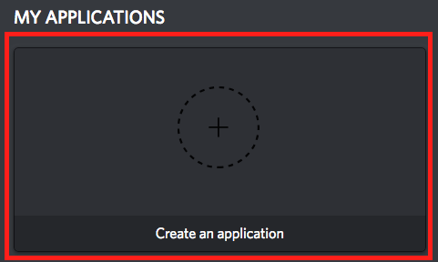

# Working on the Bot

- [Local Setup](#local-setup)
  - [Part 1: Creating Bot and Attaching it to a Development Server](#part-1-creating-bot-and-attaching-it-to-a-development-server)  
  - [Part 2: Running the Bot](#part-2-running-the-bot)  
- [Making a PR to master](#making-a-pr-to-master)  
- [Test Cases](#test-cases)  
- [Reporting Issues](#reporting-issues)  
- [FAQs](#faqs)  

## Local Setup  

### Part 1: Creating Bot and Attaching it to a Development Server  

>If the UI/steps for the following process gets changed by Discord, feel free to document the new steps and make a PR for it. We would greatly appreciate :)

1. Create your own Discord server for testing by  
   1. Going to `https://discordapp.com/channels/@me`  
   2. Clicking the + on the left side   

   

2. Navigate to `https://discordapp.com/developers/applications/me` and login  
3. Click `Create New Application`   



4. Change the name of the Application to whatever you want and then click `Save Changes`  
5. Take note of the `Client ID` for step 8  
6. Click on `Bot`   


7. Click on `Add Bot`  


8. Navigate to `https://discordapp.com/oauth2/authorize?&client_id=YOUR_CLIENT_ID_HERE&scope=bot&permissions=2119564375`
   * `YOUR_CLIENT_ID` is the `CLIENT ID` you recorded in Step 5  
9. Select the server you created and click `Authorize`  

### Part 2: Running the Bot  

>If you encounter any errors doing the following commands, feel free to add it to the [FAQs section](#faqs) at the end of the documentation for future reference :)

Pre-requisites: `git` and `docker`.  

1. Fork the [Wall-e Repo](https://github.com/CSSS/wall_e.git)  
2. clone the repo
3. Settings for Wall_E.
   1. Wall_e needs some settings in order to determine how some parts should be treated. The biggest component this impacts is whether or not you use wall_e with or without a containerized container. the below are all the settings that wall_e reads from when doing local dev work.

```shell
ENVIRONMENT = LOCALHOST
TOKEN = # the token you obtained during the authentication step
BOT_LOG_CHANNEL = #the name you want assigned to the bot_log channel
REMINDER_CHANNEL = #the name you want assigned to the channel where the reminders get printed to
COMPOSE_PROJECT_NAME = #an identitifer that docker needs when using `docker-compose`. this can by any string. try to aim for less than 5-6 characters.

# the below 2 are the name and avatar that the bot profile has on the discord guild. this can be left empty as the values will be written to by the bot.
BOT_NAME = 
BOT_AVATAR =

# the api token for wolfram, used only by the wolfram command. can be left empty if you don't have a token and dont need to work on the wolfram command
WOLFRAM_API_TOKEN =


DB_ENABLED = 0 #0 if you want to the database to be launched, used 0. otherwise use 1.
# the below 3 need to stay as is in order to be able to connect to the postgres database.
POSTGRES_DB_USER = postgres
POSTGRES_DB_DBNAME = postgres
POSTGRES_PASSWORD = postgres

# the below 3 can be whatever you want.
WALL_E_DB_USER = user_name_you_want_to_use
WALL_E_DB_DBNAME = database_name_you_want_to_use
WALL_E_DB_PASSWORD = user_password_you_want_to_use

# these are used if you want the bot to only load certain cogs. specify the file name of the cog and 0 if not enabled and 1 to enable
administration = 1
health_checks = 1
here = 1
misc = 1
mod = 1
reminders = 1
role_commands = 1
sfu = 1
```
      1. Ways to specify settings:
         1. Specify via Env varibles. just export the above settings with the specified values
         2. Specify via [`wall_e/src/resources/utilities/config/local.ini`](https://github.com/CSSS/wall_e/blob/use_pip_module/documentation/Working_on_the_Bot.md#localini). be sure to not remove the headers on the ini. Also, please keep in mind that if you specify the same setting both via environment variable and via `.ini` file,  the environment variable will take precedence.
         3. Via `docker-compose-mount-nodb.yml` or `docker-compose-mount.yml`. Can be done following [these instructions](https://docs.docker.com/compose/environment-variables/#set-environment-variables-in-containers). Note that this is the same as via Env variables. The only difference is using this option will not result in the env variable be declared in your shell environment variable.
         4. As you may see from the link in the previous point, docker provides multiple ways to pass environment variables. You can use any that work for you.


4. Commands for the bot
> Due to some compatibility issues that occured in the past when wall_e was dockerized only on the server, the dev environment for wall_e was changed so that each developer doesn't have to fight with OS issues that come with some python modules that are a bit iffy. as long as you can get `docker` and `docker-compose` working, you are golden to work on wall_e.

   1. Launching Bot with Database
```shell
# for launching the bot
//ensure that DB_ENBLED is set to 1.
docker volume create --name="${COMPOSE_PROJECT_NAME}_logs"
docker-compose -f CI/docker-compose-mount.yml up -d

# if you have made changes to your code and want to test the changes
docker stop ${COMPOSE_PROJECT_NAME}_wall_e
docker-compose -f CI/docker-compose-mount.yml up -d

# if your changes require also re-creating the database.
docker stop ${COMPOSE_PROJECT_NAME}_wall_e_db
docker rm ${COMPOSE_PROJECT_NAME}_wall_e_db
docker stop ${COMPOSE_PROJECT_NAME}_wall_e
docker-compose -f CI/docker-compose-mount.yml up -d
```

   2. Launching the bot without the database.
```shell
# for launching the bot
//ensure that DB_ENABLED is set to 0
docker volume create --name="${COMPOSE_PROJECT_NAME}_logs"
docker-compose -f CI/docker-compose-mount-nodb.yml up -d

# if you have made changes to your code and want to test the changes
docker stop ${COMPOSE_PROJECT_NAME}_wall_e
docker-compose -f CI/docker-compose-mount-nodb.yml up -d
```

5. Before you can push your changes to the wall_e repo, you will first need to make sure it passes the unit tests. that can be done like so:

```shell
docker build -t ${COMPOSE_PROJECT_NAME}_wall_e_test -f CI/Dockerfile.test --build-arg CONTAINER_HOME_DIR=/usr/src/app --build-arg UNIT_TEST_RESULTS=/usr/src/app/tests --build-arg TEST_RESULT_FILE_NAME=all-unit-tests.xml .
docker run -d --name ${COMPOSE_PROJECT_NAME}_test ${COMPOSE_PROJECT_NAME}_wall_e_test
docker logs ${COMPOSE_PROJECT_NAME}_test
```

6. Testing on [CSSS Bot Test Server](https://discord.gg/85bWteC)  
   1. After you have tested on your own Discord Test Server, Create a PR to the [Wall-E Repo](https://github.com/CSSS/wall_e/pulls) that follows the [below rules](https://github.com/CSSS/wall_e/blob/update_README/Working_on_the_Bot.md#making-a-pr-to-master) for PRs push your changes to [Wall-E](https://github.com/CSSS/wall_e). Creating the PR will automatically load it into the CSSS Bot Test Server. the name of the channel will be `pr-<PR number>`.  

## Making a PR to master  

These are the things you need to ensure are covered in your PR, otherwise the CODEOWNERS will not approve your PR, not matter how much you ping them to do so on the Discord  
 1. The description in the PR is a fair representation of what the PR is about.  
 1. The PR is fixing one thing and one thing only.  
 1. Logging. if you have N variables initialzed/used in your function, you should print all of them out to the log using logging module at least once or have a good reason why you arent.  
 1. If your PR is doing something like adding a new line or removing a new line, CODEOWNERS reserve the right to ask that you undo that change unless it was for a specific reason.  
 1. If you are adding a new command....**document**. Document the following things on help.json and the README.md  
    1. The purpose of the command  
    1. If the argument is called with any arguments.  
       1. If it is called with any arguments, please either provide a good enough explanation of the arg that a user can tell what it will do before using the command. adding an example of how to call it with the args is not necessary but good practice.  
 1. If you are making a new Class of commands, add the class to bot.json following the convention already there.  
 1. Evidence of Testing. This one needs to be completed after the PR is opened. At that point, you will go on the channel on the CSSS Wall-E Test Server that was automatically created when the PR was opened and then test the [following functionality](#test-cases). Once you had done so, you can leave a comment on the PR stating that you had done the necessary testing.  
 1. Please provide ways to test whatever you just modified on the bot in the [Test Cases section below](#test-cases) so that future PRs can be tested to ensure they dont break *your code* when merging to master  

 ## Test Cases  

 ### Administration  
  1. `.unload reminders`
  1. `.unload nothing`
  1. `.load reminders`
  1. `.load nothing`
  1. `.reload reminders`
  1. `.reload nothing`
  1. `.exc ls -l`
  1.  `.frequency`
  1. `.frequency command`  
 ### HealthChecks  
  1. `.ping`  
  1. `.echo this is the test case`
  1. `.echo "this is the test case"`
  1. `.echo 'this is the test case'`
 ### Here  
  1. `.here`
  1. `.here wall`
 ### Misc  
  1. `.poll avengers?`
  1. `.poll`
  1. `.poll “go to the moon?” “yes” “no” “boye you crazy??”`
  1. `.poll 1 2 3 4 5 6 7 8 9 10 11 12 13`
  1. `.urban girl`
  1. `.urban DevelopersDevelopersDevelopers`
  1. `.wolfram Marvel`
  1. `.wolfram giberasdfasdfadfasdf`
  1. `.emojispeak`
  1. `.emojispeak 1234_abcd`
  1. `.help`  
     1. Please ensure that the pagination is not effected by doing the following  
        1. go to the last page and then hit next when on the last page to make sure it goes back to the beginning  
        1. go to the last page from the first page by hitting previous  
        1. make sure that the done emoji does delete the help output  
  1. `.help here`
  1. `.help nothing`
 ### Mod

 ### Reminders
  1. `.remindmein`
  1. `.remindmein 10 seconds to turn in my assignment`
     1. *wait 10 seconds*
  1. `.remindmein 10 minutes to turn in my assignment`
  1. `.showreminders`
  1. `.deletereminder <messageId from previous output>`
  1. `.showreminders`
 ### RoleCommands
  1. `.newrole`
  1. `.newrole <role that already exists>`
  1. `.newrole <new role>`
  1. `.iam`
  1. `.iam <role that you already have>`
  1. `.iam <role that you do not have>`
  1. `.iamn`
  1. `.iamn <role that you have>`
  1. `.iamn <role that you dont have>`
  1. `.deleterole`
  1. `.deleterole <role that does not exist>`
  1. `.deleterole <role that exists>`
  1. `.whois`
  1. `.whois <role with no people>`
  1. `.whois <role with members>`
  1. `.whois <role that does not exist>`
  1. `.roles`
  1. `.Roles`
  1. `.purgeroles`
 ### SFU
   1. `.sfu cmpt 300`
   1. `.sfu cmpt300`
   1. `.sfu cmpt666`
   1. `.sfu blah`
   1. `.sfu`
   1. `.outline cmpt300`
   1. `.outline cmpt 300`
   1. `.outline cmpt300 spring d200`
   1. `.outline cmpt 300 spring d200`
   1. `.outline cmpt300 next`
   1. `.outline cmpt300 d200 next`
   1. `.outline cmpt300 summer d200 next`
   1. `.outline cmpt666`
   1. `.outline blah`
   1. `.outline`

 ## Reporting Issues  

 If you come across issues, follow these sets of steps, if you jump straigh to the last one with an issue that the Bot_manager recognize as not worth their time, they are in their full right to delete your email.
  1. **Google**, and spend more than 5 minutes and maybe just maybe, go onto the next page.
  1. Ask around on the [#projects_and_dev](https://discordapp.com/channels/228761314644852736/293120981067890691) channel on our Discord. Note that if your question is something really elementary that could have been solved by Google, people on there will most likely tell you to do just that.
  1. If absolutely necessary, you can email the bot-managers with the details at `csss-bot-manager@sfu.ca`. Please note that if your email is not detailed enough, the bot managers may not necessarily respond. Please over-provide with regards to what the error is, how it happened and any logs and etc rather than under-provide.

 ## FAQs  

 ## local.ini

```shell
[basic_config]
ENVIRONMENT = localhost
TOKEN =
BOT_LOG_CHANNEL = local_logs


[bot_profile]
BOT_NAME =
BOT_AVATAR =

[wolfram]
API_TOKEN =

[frequency]
enabled = 1

[database]
enabled = 1
POSTGRES_DB_USER =
POSTGRES_DB_DBNAME =
POSTGRES_PASSWORD =
WALL_E_DB_USER =
WALL_E_DB_DBNAME =
WALL_E_DB_PASSWORD =

[graph]
enabled = 1

[cogs_enabled]
administration = 1
health_checks = 1
here = 1
misc = 1
mod = 1
reminders = 1
role_commands = 1
sfu = 1
```
