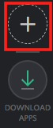
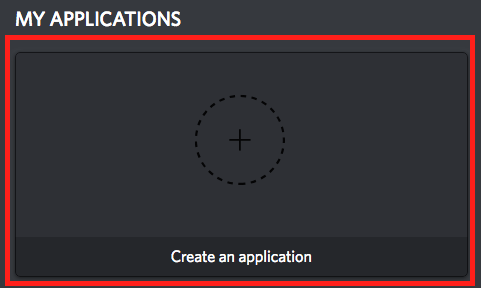
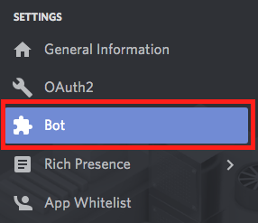
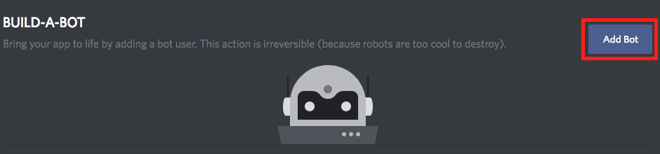

# Working on the Bot

- [Local Setup](#local-setup)
  - [Part 1: Creating Bot and Attaching it to a Development Server](#part-1-creating-bot-and-attaching-it-to-a-development-server)  
  - [Part 2: Running the Bot](#part-2-running-the-bot)  
- [Making a PR to master](#making-a-pr-to-master)  
- [Test Cases](#test-cases)  
- [Reporting Issues](#reporting-issues)  
- [FAQs](#faqs)  

## Local Setup  

### Part 1: Creating Bot and Attaching it to a Development Server  

>If the UI/steps for the following process gets changed by Discord, feel free to document the new steps and make a PR for it. We would greatly appreciate :)

1. Create your own Discord server for testing by  
   1. Going to `https://discordapp.com/channels/@me`  
   2. Clicking the + on the left side   

    

2. Navigate to `https://discordapp.com/developers/applications/me` and login  
3. Click `Create New Application`   

 

4. Change the name of the Application to whatever you want and then click `Save Changes`  
5. Take note of the `Client ID` for step 8  
6. Click on `Bot`   

 

7. Click on `Add Bot`  

 

8. Navigate to `https://discordapp.com/oauth2/authorize?&client_id=YOUR_CLIENT_ID_HERE&scope=bot&permissions=2119564375`
   * `YOUR_CLIENT_ID` is the `CLIENT ID` you recorded in Step 5  
9. Select the server you created and click `Authorize`  

### Part 2: Running the Bot  

>If you encounter any errors doing the following commands, feel free to add it to the [FAQs section](#faqs) at the end of the documentation for future reference :)

Pre-requisites: `git`.  

1. Python3.5 Instructions
   1. Mac
      1. Download and install the Mac Python3.5 package [here](https://www.python.org/downloads/release/python-350/)
      1. Run `curl https://bootstrap.pypa.io/get-pip.py -o get-pip.py`
      1. Run `python3.5 get-pip.py`
   1. Ubuntu
      1. Run `sudo apt-get install -y python 3.5`
1. Fork the [Wall-e Repo](https://github.com/CSSS/wall_e.git)  
1. From commandline, run following commands  
   1. Run `git clone <the url of your forked repo>`  
   1. cd into `wall_e` directory  
   1. Run `python3.5 -m venv ENV`  
   1. Run `. ENV/bin/activate`  
   1. Run `python3.5 -m pip install -r requirements.txt`  
   1. Redis Instructions  
      1. Mac  
         1. Run `brew install redis`  
         1. Add `notify-keyspace-events "Ex"` to the end of `/usr/local/etc/redis.conf`  
         1. Run `brew services start|stop|restart redis` to start, stop and restart redis  
      1. Ubuntu  
         1. Run `sudo apt-get install -y redis-server`  
         1. Add `notify-keyspace-events "Ex"` to the end of `/etc/redis/redis.conf`  
         1. Run `sudo service redis-server start`  
   1. Using Your Own Discord Test Server  
      1. Run `export ENVIRONMENT='localhost'`  
      1. Run `export TOKEN=token` with the `token` you obtained during the authentication step  
      1. Run `export BOT_LOG_CHANNEL_ID=channel_id` with the channel id of the channel that will hold the logs on the discord server  
      1. Run `export WOLFRAMAPI=apikey` with an API key obtained from [here](https://products.wolframalpha.com/api/)  
         1. You can also do `export WOLFRAMAPI='dev'` if you dont want to open a WolframAlpha account [this doesnt work if you need to do work that involves the `.wolfram` command]  
      1. Run `python3.5 main.py`  
1. Testing on [CSSS Bot Test Server](https://discord.gg/85bWteC)  
   1. After you have tested on your own Discord Test Server, Create a PR to the [Wall-E Repo](https://github.com/CSSS/wall_e/pulls) that follows the [below rules](https://github.com/CSSS/wall_e/blob/update_README/Working_on_the_Bot.md#making-a-pr-to-master) for PRs push your changes to [Wall-E](https://github.com/CSSS/wall_e). Creating the PR will automatically load it into the CSSS Bot Test Server. the name of the channel will be `pr-<PR number>`.  

## Making a PR to master  

These are the things you need to ensure are covered in your PR, otherwise the CODEOWNERS will not approve your PR, not matter how much you ping them to do so on the Discord  
 1. The description in the PR is a fair representation of what the PR is about.  
 1. The PR is fixing one thing and one thing only.  
 1. Logging. if you have N variables initialzed/used in your function, you should print all of them out to the log using logging module at least once or have a good reason why you arent.  
 1. If your PR is doing something like adding a new line or removing a new line, CODEOWNERS reserve the right to ask that you undo that change unless it was for a specific reason.  
 1. If you are adding a new command....**document**. Document the following things on help.json and the README.md  
    1. The purpose of the command  
    1. If the argument is called with any arguments.  
       1. If it is called with any arguments, please either provide a good enough explanation of the arg that a user can tell what it will do before using the command. adding an example of how to call it with the args is not necessary but good practice.  
 1. If you are making a new Class of commands, add the class to bot.json following the convention already there.  
 1. Evidence of Testing. This one needs to be completed after the PR is opened. At that point, you will go on the channel on the CSSS Wall-E Test Server that was automatically created when the PR was opened and then test the [following functionality](#test-cases). Once you had done so, you can leave a comment on the PR stating that you had done the necessary testing.  
 1. Please provide ways to test whatever you just modified on the bot in the [Test Cases section below](#test-cases) so that future PRs can be tested to ensure they dont break *your code* when merging to master  
 
 ## Test Cases  

 1. `.ping`  
 1. `.echo this is the test case`  
 1. `.help`  
    1. Please ensure that the pagination is not effected by doing the following  
       1. go to the last page and then hit next when on the last page to make sure it goes back to the beginning  
       1. go to the last page from the first page by hitting previous  
       1. make sure that the done emoji does delete the help output  
1. `.here`  
1. `.here k`  
1. `.poll`  
1. `.poll "question"`  
1. `.poll question answer1 answer 2`  
1. `.urban yo`  
1. `.wolfram 1+1`  
1. `.remindmein 20 seconds to test`  
1. `.showreminders`  
1. `.deletereminder <output from showreminder>`  
1. `.remindmein 10 seconds to test`  
   1. wait 10 seconds to ensure that the reminder did get sent
1. `.iam <whatever_name_you_want_to_use>`  
1. `.newrole <whatever_name_you_want_to_use>`  
1. `.whois <whatever_name_you_want_to_use>`  
1. `.iam <whatever_name_you_want_to_use>`  
1. `.whois <whatever_name_you_want_to_use>`  
1. `.deleterole <whatever_name_you_want_to_use>`  
1. `.iamn <whatever_name_you_want_to_use>`  
1. `.whois <whatever_name_you_want_to_use>`  
1. `.deleterole <whatever_name_you_want_to_use>`  
1. `.roles`  
1. `.Roles`
1. `.sfu cmpt 300`
1. `.sfu cmpt300`
1. `.sfu cmpt666`
1. `.sfu blah`
1. `.sfu`
1. `.outline cmpt300`
1. `.outline cmpt 300`
1. `.outline cmpt300 spring d200`
1. `.outline cmpt 300 spring d200`
1. `.outline cmpt300 next`
1. `.outline cmpt300 d200 next`
1. `.outline cmpt300 summer d200 next`
1. `.outline cmpt666`
1. `.outline blah`
1. `.outline`

 ## Reporting Issues  

 If you come across issues, follow these sets of steps, if you jump straigh to the last one with an issue that the Bot_manager recognize as not worth their time, they are in their full right to delete your email.
  1. **Google**, and spend more than 5 minutes and maybe just maybe, go onto the next page.
  1. Ask around on the [#projects_and_dev](https://discordapp.com/channels/228761314644852736/293120981067890691) channel on our Discord. Note that if your question is something really elementary that could have been solved by Google, people on there will most likely tell you to do just that.
  1. If absolutely necessary, you can email the bot-managers with the details at `csss-bot-manager@sfu.ca`. Please note that if your email is not detailed enough, the bot managers may not necessarily respond. Please over-provide with regards to what the error is, how it happened and any logs and etc rather than under-provide.

 ## FAQs  